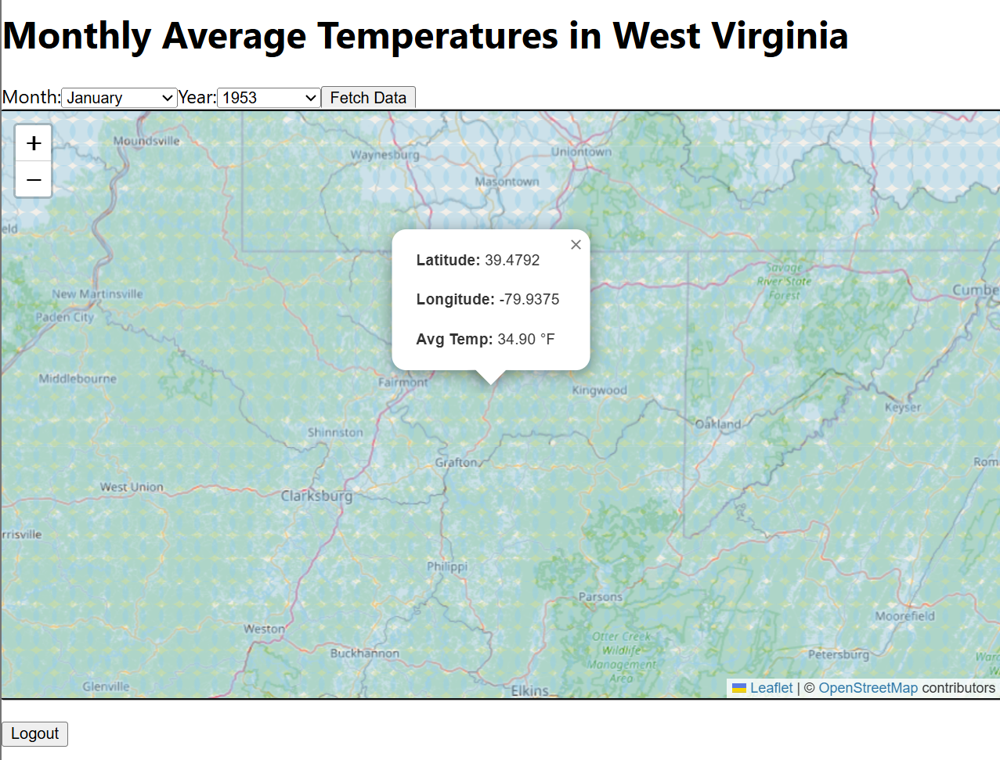

# ExPostForecast


This repository contains a staged, instructional full-stack web application that demonstrates how to build, deploy, and secure a cloud-connected weather visualization app using **React**, **Node.js**, **MySQL**, and **Azure**.

The app displays **historical monthly average temperatures** across West Virginia using NOAA climate data. It includes user authentication, a map-based frontend, and cloud-backed services.



---

## 🎓 Purpose

This repo is designed to **teach full-stack web app development** in an undergraduate course setting using a sprint-based structure. Students implement a new set of features during each two-week sprint.

---

## 🚦 Sprint Overview

| Sprint | Description |
|--------|-------------|
| **Sprint 1** | Local setup of frontend using React; prepares for secure login |
| **Sprint 2** | Adds local backend using Node.js for login; connects to Azure MySQL |
| **Sprint 3** | Deploys frontend as an Azure Static Web App using GitHub Actions |
| **Sprint 4** | Deploys backend to Azure App Service with cloud-based API endpoints |

---

## 🧱 Tech Stack

- **Frontend**: React, Leaflet, Axios, .env for config
- **Backend**: Node.js, Express, MySQL2, JWT, bcrypt
- **Database**: Azure Database for MySQL
- **Deployment**: Azure App Service, Azure Static Web Apps, GitHub Actions

---

## 🗺️ Features

- Interactive map with historical temperature overlays
- NOAA grid cell data using STAC API
- Secure user login with JWT
- Responsive interface with dropdown selectors for year/month
- Deployed using CI/CD pipelines

---

## 📁 Repo Structure

```
wv-temperature-map-demo/
├── sprint1-frontend-setup/
├── sprint2-login-backend/
├── sprint3-deploy-frontend/
├── sprint4-deploy-backend/
├── shared/                # Common docs, assets, or config templates
├── .github/               # CI/CD workflows
├── screenshot1.png
└── README.md
```

---

## 📊 Data Source

Data is derived from NOAA's **nClimGrid** collection via Microsoft's Planetary Computer and the STAC API interface. This provides accurate, gridded climate data going back to 1951.

---

## 🧑‍🏫 For Instructors

This project is built to align with sprint-based teaching. You can assign one sprint at a time and use it to teach:

- GitHub project setup & version control
- CI/CD with GitHub Actions
- Frontend/backend decoupling
- API development & data fetching
- Cloud deployment & service integration

---

## 📄 License

MIT License. See [LICENSE](./LICENSE) for details.
